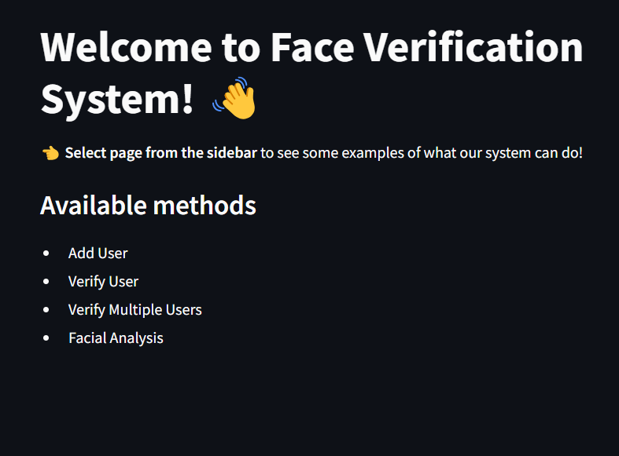
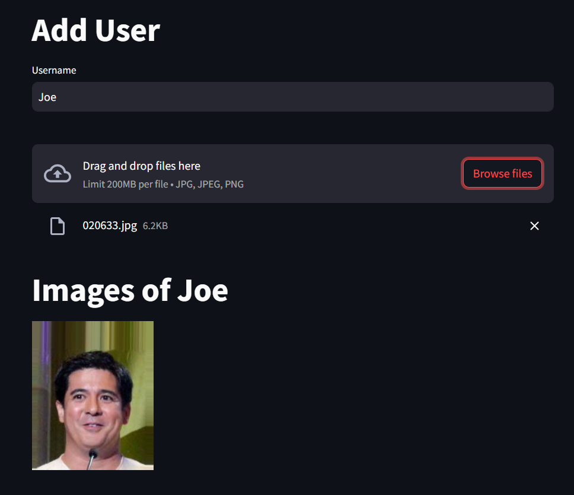
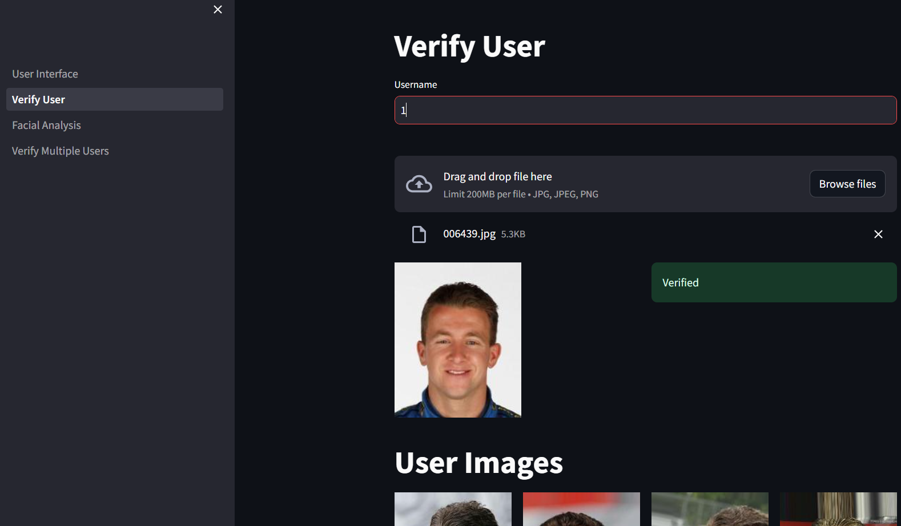
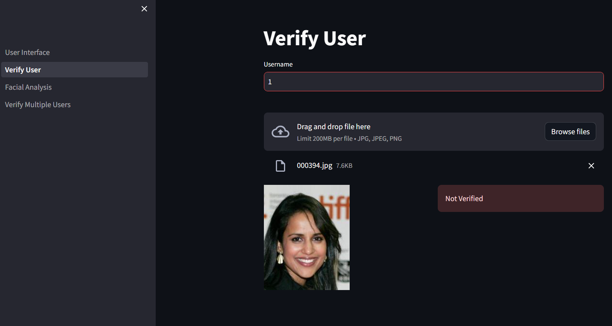
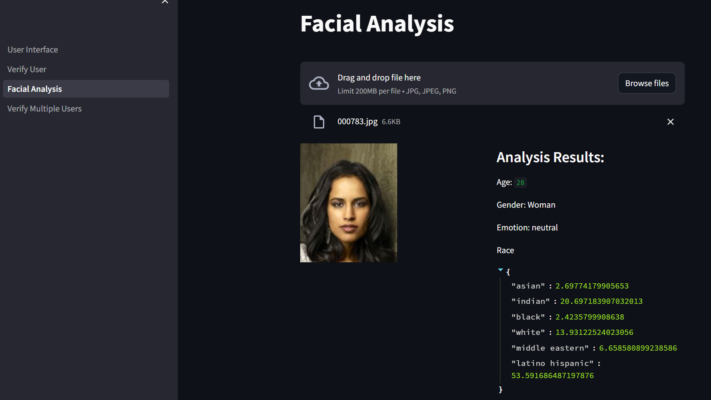
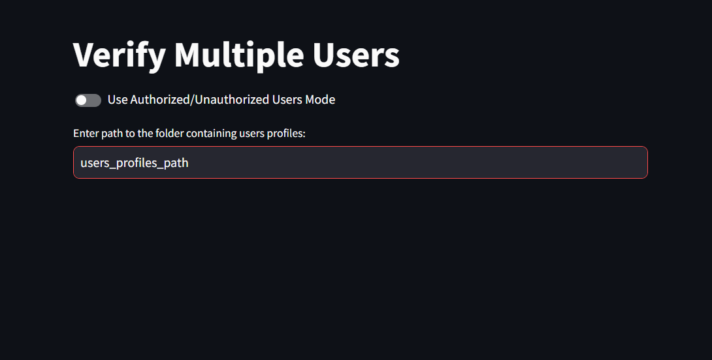

# Facial Recognition 👨
Authors: *Jakub Polczyk*, *Szymon Leszkiewicz*, *Kacper Kozaczko*

## Table of Contents
1. [Project description](#Project-description)
2. [System requirements](#System-requirements)
3. [How to run the app?](#How-to-run-the-app)
4. [App Screenshots](#App-Screenshots)
5. [Experiments results](#Experiments-results)
   1. [System's metrices tested on authorized users](#Systems-metrices-tested-on-authorized-users)
   2. [System's metrices tested on authorized users and unauthorized users](#Systems-metrices-tested-on-authorized-and-unauthorized-users)
   3. [System's metrices tested on images with Gaussian Noise](#Systems-metrices-tested-on-images-with-Gaussian-Noise)
   4. [System's metrices tested on images wiith luminance noise](#Systems-metrices-tested-on-images-with-luminance-noise)

## Project description
The aim of the project is to use the user authorization system in
based on facial biometrics and testing the system's resistance to interference. Project developed in Python, using **CelebA** dataset and **DeepFace** model. System should be as secure as possible, therefore it should never accept unauthorized users.

## System Requirements
- System design
- Testing the system for user acceptance
- Examine the system for noisy user photos
- Proposing metrics for analysis
- Creation of the User Interface

## How to run the app?
```python
streamlit run User_Interface.py
```

## App Screenshots
**Welcome Page**


**Adding user to biometric system**


**Positive verification**


**Negative verification**


**Facial analysis**


**Verifying multiple users**


## Experiments results

Experiments performed using 
- **False Acceptance Rate**
- **False Rejection Rate**
- **Accuracy**

### System's metrices tested on authorized users
| **FRR**    | **FAR** |  **FAR** | 
| -------- |---------|------- |
| 0.095  | ---     | 0.905    |

### System's metrices tested on authorized and unauthorized users
| **FRR** | **FAR** | **ACC** |
| ------- | ------- | ------- |
| 0.095   | 0.000   | 0.953   |

### System's metrices tested on images with Gaussian Noise
| **Poziom PSNR** | **FRR** | **FAR** | **ACC** |
|---|---|---|---|
| 70 dB | 0.151 | 0.0 | 0.927 |
| 50 dB | 0.131 | 0.0 | 0.937 |
| 30 dB | 0.161 | 0.0 | 0.923 |
| 20 dB | 0.367 | 0.0 | 0.823 |
| 10 dB | 0.889 | 0.0 | 0.571 |

### System's metrices tested on images with luminance noise
| **Poziom zniekształcenia** | **FRR** | **FAR** | **ACC** |
| -------------------------- | ------- | ------- | ------- |
| kwadratowy                 | 0.156   | 0.000   | 0.925   |
| liniowy 0.50   | 0.136   | 0.000   | 0.935   |
| liniowy 0.60   | 0.131   | 0.000   | 0.937   |
| liniowy 0.75   | 0.126   | 0.000   | 0.939   |
| liniowy 1.25   | 0.141   | 0.000   | 0.932   |
| liniowy 1.50   | 0.171   | 0.000   | 0.918   |
| o stałą -100              | 0.312   | 0.000   | 0.850   |
| o stałą -20               | 0.126   | 0.000   | 0.939   |
| o stałą -10               | **0.121** | 0.000   | **0.942** |
| o stałą 30                | 0.131   | 0.000   | 0.937   |
